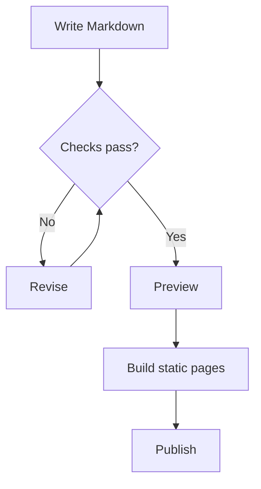

# XiaoMai

> An expressive, anime-inspired static blog theme built on **Material 3 Expressive**, **Astro 7**, and **Svelte 5**.

XiaoMai (Chinese: 小麦, "wheat") is a modern static blog theme: it unifies visuals with the Material 3 Expressive design language, pairs Svelte 5's fine-grained reactivity with Swup's无缝 page transitions, and ships a ready-to-use set of Markdown authoring enhancements (admonitions, Mermaid, KaTeX, code blocks, video, lightbox, encrypted posts, and more). The theme uses a split **code repo (theme) + content repo (posts / data / assets)** architecture for easier collaboration and backups.

[在线预览](https://xiaomai.l.cd/)


[](./LICENSE)

</div>

> 

---

## Table of Contents

- [Features](#features)
- [Tech Stack](#tech-stack)
- [Quick Start](#quick-start)
- [Split Content Repo](#split-content-repo)
- [Content Types](#content-types)
- [Configuration System](#configuration-system)
- [Markdown Authoring Syntax](#markdown-authoring-syntax)
- [Music Player](#music-player)
- [Internationalization](#internationalization)
- [Build & Deploy](#build--deploy)
- [Project Structure](#project-structure)
- [Screenshots (Placeholders)](#screenshots-placeholders)
- [License & Credits](#license--credits)

---

## Features

XiaoMai covers the full loop from writing to reading, interaction, and operations. Most enhancements load on demand client-side (dynamic `import()` per selector) to balance first paint and richness.

**Interface & Reading**

- **Material 3 Expressive design system**: unified design tokens (color / shape / typography / spacing), dynamic color and accent.
- **Light / Dark themes**: built-in light and dark palettes, plus a "Display Settings" panel (font size, corner radius, density, …).
- **Seamless page transitions**: Swup-based smooth transitions and preloading, SPA-like browsing.
- **Top app bar / Sidebar / Context menu / Floating Action Button (FAB)**: composable modern chrome.
- **Site-wide search**: static index via [Pagefind](https://pagefind.app/) (generated at build time).
- **Back-to-top / Route progress / Announcement / Banner stage**: polished details.

**Content Rendering**

- **Admonitions**: native M3 style (accent left bar + tinted surface + rounded corners) with type-specific inline SVG icons: `note`/`info` (info circle), `tip` (light bulb), `important` (dialog), `warning` (exclamation circle), `caution` (triangle); plus collapsible `details`.
- **Mermaid diagrams**: flowchart, sequence, ER, class, state, XY chart, pie, gantt, mindmap, timeline, journey, gitGraph, kanban, sankey, etc. — rendered client-side (`securityLevel: strict`, with source fallback on failure).
- **KaTeX math**: inline `$...$` and block `$$...$$`, with horizontal scroll containers.
- **Expressive Code blocks**: title / terminal frame / line numbers / collapsible sections / line markers (add/delete/edit) / text highlight / word wrap, light & dark themes.
- **Fancybox lightbox gallery**: click to open fullscreen with zoom (Panzoom).
- **Image Bloom**: soft glow / halo effect on images.
- **Albums**: image galleries, including password-protected albums.

**Media & Interaction**

- **Music player**: four modes — `local` (local) / `custom` (custom API) / `meting` (Meting API: NetEase / QQ / Kugou …) / `mixed` (hybrid). Mountable in the sidebar.
- **Video embeds**: Bilibili, AcFun, YouTube, ArtPlayer — lazy-loaded posters (video-facade), loaded on click to save bandwidth.
- **GitHub cards**: embed repo / user cards inside posts.
- **Audio Reader**: play designated clips as speech (loaded on demand).
- **Article share / share poster**: generate a shareable poster and link.
- **Comments**: `none` (off) or `twikoo`.

**Authoring (Markdown extensions)**

- Steps, Tabs (option groups), Collapse panels, Annotations, Spoiler, Abbreviations.
- Encrypted posts: PasswordGate + Web Crypto (AES-256-GCM + PBKDF2); after decryption the client re-initializes enhancements (Mermaid / Fancybox / TOC / math …).
- Archive panel, category bar, article discovery (related), feed guide, moments, snippets.

**Operations & Ecosystem**

- **RSS / Sitemap**: via `@astrojs/rss` and `@astrojs/sitemap`.
- **Umami analytics**: via `oddmisc` integration (optional, enabled when configured).
- **LLM-friendly output**: `llms.txt` etc. (`llmsConfig`).
- **Friend links / Compass**: `/friends/` page and discovery compass.

---

## Tech Stack

| Area | Choice |
| --- | --- |
| Framework | Astro `7.2.6` (static output) |
| UI | Svelte `5.56.8` (fine-grained reactivity) |
| Styling | Tailwind CSS 4 + Stylus (design tokens) |
| Design | Material 3 Expressive (M3E), `@material/material-color-utilities` |
| Transitions | `@swup/astro` (no-reload, preload, smooth scroll) |
| Code highlight | `astro-expressive-code` (Collapsible Sections / Line Numbers / custom copy / language badge plugins) |
| Icons | `astro-icon` + `@iconify/svelte` (material-symbols / fa6) |
| Math | `katex` + `remark-math` / `rehype-katex` |
| Diagrams | `mermaid` `^11.17.0` (dynamic client `import()`) |
| Search | `pagefind` |
| Fonts | Fontsource (Outfit / Roboto / JetBrains Mono / LXGW WenKai) + subsetting |
| Quality | Biome (format / lint), Playwright (E2E / a11y), Lighthouse CI |

---

## Quick Start

> Requirements: Node.js ≥ 20, package manager **pnpm** (the repo `preinstall` locks to pnpm via `only-allow`).

```bash
# 1. Install dependencies
pnpm install

# 2. Sync the content repo (first run and whenever content changes)
pnpm content:sync

# 3. Start the dev server (default http://localhost:4321)
pnpm dev
```

Common scripts:

| Command | Purpose |
| --- | --- |
| `pnpm dev` / `pnpm start` | sync content + generate icons / thumbnails + `astro dev` |
| `pnpm build` | full build: sync → icons → thumbnails → font subset → `astro build` → `pagefind` → font check |
| `pnpm preview` | preview the built output locally |
| `pnpm content:sync` | pull & mount content / data / assets from the content repo |
| `pnpm content:watch` | watch the content repo and hot-sync |
| `pnpm content:status` | show content sync status |
| `pnpm content:validate` | dry-run validation of the content manifest |
| `pnpm content:eject` / `content:export` | eject / export content |
| `pnpm new-post` | scaffold a new post from a template |
| `pnpm check` | `astro check` type check |
| `pnpm format` / `pnpm lint` | Biome format / check |
| `pnpm test` | Playwright end-to-end tests |
| `pnpm fonts:subset` | generate font subsets (before production build) |

---

## Split Content Repo

XiaoMai separates the **code repo (theme)** from the **content repo (posts / data / assets)**, driven by `xiaomai.content.json` at the repo root:

```jsonc
{
  "schemaVersion": 1,
  "source": {
    "type": "git",
    "url": "https://github.com/OWNER/xiaomai-content.git",
    "ref": "main"
  },
  "mounts": {
    "content": "src/content",
    "data":   "src/data",
    "assets": "src/assets",
    "public": "public"
  },
  "keep": [],
  "prune": true
}
```

- The content repo is mounted into the code repo's `src/content`, `src/data`, `src/assets`, `public` via `scripts/content/sync.mjs`.
- `prune: true` removes local content that no longer exists in the source; `keep` preserves specified local overrides.
- **Note**: data files (e.g. `data/compass.ts`) and assets are replaced wholesale (no incremental merge). To make assets / data actually take effect, put them in the **content repo** (`public/`, `data/`), not only the code repo.
- User overrides (site / sidebar / music …) can layer over `src/config/*` defaults via `config/*.yaml` in the content repo (see "Configuration System").

> A template `xiaomai.content.example.json` is included; copy it to `xiaomai.content.json` and fill in your content repo URL.

---

## Content Types

Content is organized as [Astro Content Collections](https://docs.astro.build/en/guides/content-collections/) under `src/content/`:

| Collection | Directory | Notes |
| --- | --- | --- |
| `posts` | `src/content/posts` | Long-form posts; Markdown / MDX, encryption, category, tags, permalinks, `pinned`, `draft` |
| `moments` | `src/content/moments` | Lightweight updates / microblog, with thumbnails |
| `snippets` | `src/content/snippets` | Standalone short snippets |

Common frontmatter fields: `title`, `published`, `description`, `tags`, `category`, `lang`, `draft`, `pinned`, `encrypted`, `password`, `passwordHint`, `hideHomeContent`, `cover`.

---

## Configuration System

Theme behavior lives in `src/config/`, one typed module per concern:

| Module | Responsibility |
| --- | --- |
| `siteConfig` | Site name, URL, `base`, default language, timezone |
| `profileConfig` | Author profile (avatar, name, bio, social links) |
| `navBarConfig` | Top navigation bar items |
| `sidebarConfig` | Sidebar layout (incl. `music` widget toggle) |
| `footerConfig` | Footer (supports custom HTML) |
| `commentConfig` | Comments: `none` / `twikoo` |
| `musicConfig` | Music player: `local` / `custom` / `meting` / `mixed` |
| `announcementConfig` | Site-wide announcement |
| `contextMenuConfig` | Right-click context menu |
| `expressiveCodeConfig` | Code block light/dark themes |
| `fabConfig` | Floating action button (FAB) |
| `fontConfig` | Fonts (body / cjk / mono roles, subsetting toggle) |
| `imageBloomConfig` | Image bloom effect |
| `licenseConfig` | Default article license |
| `llmsConfig` | LLM-friendly output (`llms.txt`) |
| `permalinkConfig` | Permalink / URL structure |
| `postListConfig` | Post list display |
| `umamiConfig` | Umami analytics (enables `oddmisc` when set) |
| `articleConfig` | Article page options |

**User override layer**: you normally don't edit theme source. `config/*.yaml` in the content repo overlays `src/config/*` defaults (see `src/config/README.md` and `scripts/content/config-overlay.mjs`).

---

## Markdown Authoring Syntax

These snippets are taken from the theme's built-in example posts (`src/content/posts/`) and can be reused directly.

### Admonitions

```markdown
::: note Deployment context
Space-separated form accepts a custom title and stays compatible with reference syntax.
:::

::: info
Neutral contextual info block.
:::

::: tip[Existing **label** syntax]
Bracket labels still work and may contain inline Markdown emphasis.
:::

> [!IMPORTANT]
> GitHub Alert syntax enters the same renderer, keeping a unified visual language.

::: warning
Check environment variables before a production build.
:::

::: caution
Do not publish credentials or private keys with the examples.
:::

::: details Inspect the full command
Collapsible block, closed by default, keyboard-accessible without client JS.
:::
```

Supported types: `note` / `info` / `tip` / `important` / `warning` / `caution` / `details`.

### Mermaid Diagrams

Use a standard `mermaid` fence; the server keeps a source fallback and the browser enhances it into themed SVG:

````markdown

````

Supported: flowchart / sequenceDiagram / erDiagram / classDiagram / stateDiagram / xychart-beta / pie / gantt / mindmap / timeline / journey / gitGraph / kanban / sankey-beta.

### Math (KaTeX)

```markdown
Inline: Euler's identity $e^{i\pi} + 1 = 0$.

Block:

$$
f(x) = \frac{1}{\sigma \sqrt{2\pi}} \exp\left( -\frac{(x - \mu)^2}{2\sigma^2} \right)
$$
```

### Code Blocks (Expressive Code)

````markdown
```js title="my-file.js" showLineNumbers
console.log('Code block with title and line numbers')
```

```ts {1, 4, 7-8} del={2} ins={3-4}
function demo() {
  console.log('marked deleted')
  console.log('marked inserted')
}
```

```js collapse={1-5, 12-14} wrap
// Boilerplate is collapsed; long lines wrap
```

```sh frame="none"
echo "Frameless code block"
```
````

Common meta options: `title="..."`, `frame="none"|"code"`, `showLineNumbers` / `startLineNumber=5`, `{line}` line highlight, `del={}`/`ins={}` line markers, `collapse={1-5}` sections, `wrap` / `wrap=false`, text highlight `"given text"` or regex `/ye[sp]/`.

### Video Embeds

```markdown
::youtube{id="5gIf0_xpFPI" title="YouTube video" preload="auto"}

::bilibili{bvid="BV1fK4y1s7Qf" title="Bilibili video" p=1 preload="auto"}

::acfun{acid="ac48649632" title="AcFun video" preload="auto"}

::artplayer{src="https://example.com/video.mp4" title="Video" preload="auto"}
```

Raw platform `<iframe>` embeds are also supported.

### GitHub Cards

```markdown
::github{repo="withastro/astro"}
```

### Spoiler

```markdown
The answer is :spoiler[**42**], the rest stays plain Markdown.
```

### Tabs (Option Groups)

````markdown
::: tabs#package-manager

@tab npm

Install with npm:

```powershell
npm install astro
```

@tab:active **pnpm**#pnpm

Install with pnpm:

```powershell
pnpm.cmd add astro
```

:::
````

Groups sharing the same `#id` sync their selection and remember it on next visit; `@tab:active` sets the default, `#value` provides a stable value.

### Collapse Panels

````markdown
::: collapse accordion expand
- :+ Install dependencies

  Run the package command from the repo root.

  ```powershell
  pnpm.cmd install
  ```

- Verification commands

  Check the content pipeline before building.
:::
````

`::: collapse` expands independently; add `accordion` to keep only one open; add `expand` to open the first by default; `:+` before a list item opens it, `:-` keeps it closed. The container must be a single top-level unordered list.

### Annotations

```markdown
Astro hydrates only interactive islands when needed [+islands].

[+islands]:
  An island is an interactive UI component surrounded by static HTML, keeping the default page lightweight.
```

`[+label]` is an inline reference; `[+label]:` is its definition (may include paragraphs, lists, links). Undefined references stay as plain text.

### Abbreviations

```markdown
*[SSR]: Server-Side Rendering
*[LCP]: Largest Contentful Paint

SSR makes HTML available before client scripts run.
```

### Audio Reader

```markdown
:audio-reader[Clip title]{src="/assets/audio/filename.wav"}
```

`src` must be a site-root path or HTTPS URL; the label must not be empty.

### Steps

````markdown
:::steps[Production deployment]
1. **Clone and prepare the workspace**

   ```powershell
   git clone https://github.com/GrowWheat/XiaoMai.git
   ```

2. **Install dependencies**

   ```powershell
   pnpm.cmd install
   ```
:::
````

`:::steps[title]` or `title="..."` adds a visible label; `start=4` changes the first step number. The container must be a single ordered list.

### Encrypted Posts

Declare in the post frontmatter:

```yaml
---
title: Password-protected post
encrypted: true
password: "your-secret"
passwordHint: "Hint: the default unlock password is your-secret"
hideHomeContent: true
---
```

- `encrypted`: explicitly mark as encrypted (implied `true` when `password` is set).
- `password`: used to encrypt at build time and to unlock at runtime.
- `passwordHint`: optional hint shown under the password field.
- `hideHomeContent`: hide description & word count on index cards / archives / RSS (default `true`).

Decryption uses Web Crypto (AES-256-GCM + PBKDF2, 310k iterations + random salt / IV, AAD scoped to the post). After decryption the TOC is rebuilt and Mermaid / KaTeX / Fancybox enhancements re-initialized. The session lasts 30 minutes and persists across refreshes and Swup navigations.

---

## Music Player

Configured via `src/config/musicConfig.ts`, with four modes:

| Mode | Notes |
| --- | --- |
| `local` | Local standalone playlist (default); list tracks directly in config |
| `custom` | Custom list API; pull the playlist from your endpoint |
| `meting` | Cloud playlist via Meting API (e.g. `server: "netease", type: "playlist", id: "..."`) |
| `mixed` | Hybrid (recommended): local + Meting cloud merged |

The sidebar player mounts only after the `music` widget is enabled in `sidebarConfig`.

---

## Internationalization

Ten built-in languages under `src/i18n/languages/`:

`en` · `es` · `id` · `ja` · `ko` · `th` · `tr` · `vi` · `zh_CN` · `zh_TW`

UI strings and date formats switch with the language; default language and `base` are set in `siteConfig`.

---

## Build & Deploy

XiaoMai outputs a **fully static site** deployable to any static host:

```bash
pnpm build      # produces dist/
pnpm preview    # preview locally
```

- **Search**: `pagefind --site dist` generates the index at build time; site-wide search works after deploy.
- **Font subsetting**: run `pnpm fonts:subset` before a production build (the build script already chains it) to shrink fonts.

### Vercel

The repo includes `vercel.json`; connect the repo for automatic deploys.

### GitHub Pages / Any Static Host

Publish `dist/` as the site directory; set `base` and `site` in `siteConfig` (the theme uses `trailingSlash: "always"`, so paths carry a trailing slash).

**Nginx example** (put `dist/` at `/var/www/xiaomai`):

```nginx
server {
    listen 80;
    server_name your.domain.com;
    root /var/www/xiaomai;
    index index.html;

    # Long-cache static assets
    location ~* \.(?:css|js|woff2?|avif|webp|png|jpg|jpeg|gif|svg|ico|ttf|eot)$ {
        expires 30d;
        add_header Cache-Control "public, immutable";
        try_files $uri =404;
    }

    # Static pages with trailing slash
    location / {
        try_files $uri $uri/ =404;
    }

    gzip on;
    gzip_types text/plain text/css application/javascript application/json image/svg+xml;
}
```

> If the site lives under a subpath (e.g. `https://example.com/blog/`), set `siteConfig.base` to `/blog/` and adjust the Nginx `location` accordingly.

---

## Project Structure

```
xiaomai/
├─ astro.config.mjs          # Astro / Swup / Expressive Code / Icon integration & font resolution
├─ package.json              # scripts & deps (pnpm-locked)
├─ xiaomai.content.json      # split content sync config (template: .example)
├─ vercel.json               # Vercel deploy config
├─ src/
│  ├─ config/                # theme config modules (see "Configuration System")
│  ├─ content/               # collections: posts / moments / snippets
│  ├─ components/
│  │  ├─ organisms/           # page-level components (sidebar, music, friends, encryption, search…)
│  │  └─ atoms/               # atomic components (incl. Icon display)
│  ├─ utils/                 # client enhancements (mermaid / katex / fancybox / …)
│  ├─ i18n/                  # 10 language translations
│  └─ styles/                # global styles & design tokens (incl. admonitions.css)
├─ scripts/
│  ├─ content/               # content repo sync / validate / eject
│  ├─ icons/                 # local icon generation
│  ├─ images/                # moment thumbnail generation
│  └─ fonts/                 # font subset & check
├─ public/                   # static assets (mounted from content repo)
├─ docs/                     # internal theme docs (fonts, animation, components, CI…)
└─ tests/                    # Playwright tests
```

See `docs/` (font system, animation, atomic structure, FAB, context menu, content separation …) and `AGENTS.md` / `CONTRIBUTING.md` / `DESIGN.md` for more.

---

## Screenshots (Placeholders)

> Screenshot placeholders. Drop the images into `docs/screenshots/` and replace the paths to show them in the docs.

| Suggested file | Content |
| --- | --- |
| `docs/screenshots/home-light.png` | Light-theme home |
| `docs/screenshots/home-dark.png` | Dark-theme home |
| `docs/screenshots/post.png` | Post page (admonitions / code blocks) |
| `docs/screenshots/mermaid.png` | Mermaid rendering example |
| `docs/screenshots/sidebar-music.png` | Sidebar music player |
| `docs/screenshots/encrypted.png` | Encrypted post password gate |
| `docs/screenshots/search.png` | Site-wide search results |
| `docs/screenshots/mobile.png` | Mobile responsive layout |

```markdown


```

---

## License & Credits

- Theme is open source under the **MIT** license (see `LICENSE`).
- Design language based on **Material 3 Expressive**; icons from Material Symbols and Font Awesome 6 (via Iconify).
- Thanks to Astro, Svelte, Expressive Code, Swup, Pagefind, Mermaid, KaTeX, and other upstream projects.
- Maintainer: **GrowWheat** (GitHub: `https://github.com/GrowWheat/XiaoMai`).
