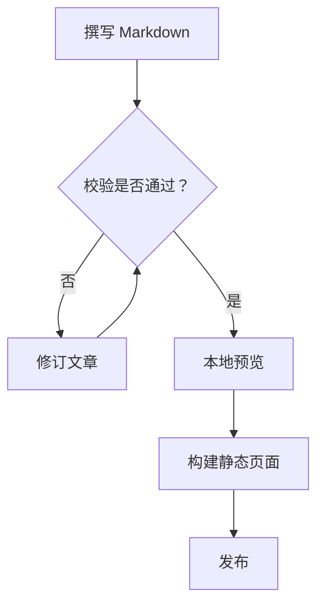

# XiaoMai · 小麦

> 一个基于 **Material 3 Expressive**、**Astro 7** 与 **Svelte 5** 构建的、富有表现力与二次元气质的静态博客主题。

XiaoMai（中文名「小麦」）是一套现代静态博客主题：以 Material 3 Expressive 设计语言统一视觉，配合 Svelte 5 的细粒度交互、Swup 的无刷新页面转场，以及一套开箱即用的 Markdown 写作增强（提示块、Mermaid、KaTeX、代码块、视频、灯箱、加密文章等）。主题采用「代码仓 / 内容仓」双仓分离的架构，便于协作与备份。

[在线预览](https://xiaomai.l.cd/)


[](./LICENSE)
</div>

> 

---

## 目录

- [特性一览](#特性一览)
- [技术栈](#技术栈)
- [快速开始](#快速开始)
- [双仓内容分离](#双仓内容分离)
- [内容类型](#内容类型)
- [配置系统](#配置系统)
- [Markdown 写作语法](#markdown-写作语法)
- [音乐播放器](#音乐播放器)
- [国际化](#国际化)
- [构建与部署](#构建与部署)
- [目录结构](#目录结构)
- [截图占位](#截图占位)
- [许可与致谢](#许可与致谢)

---

## 特性一览

XiaoMai 覆盖了从写作到阅读、从互动到运维的完整链路，且多数增强在客户端按需动态加载（按选择器动态 `import()`），兼顾首屏性能与功能丰富度。

**界面与阅读**

- **Material 3 Expressive 设计体系**：统一的设计令牌（颜色 / 形状 / 排版 / 间距）、动态色彩与强调色。
- **明 / 暗双主题**：内置浅色与深色配色，附「显示设置」面板（字号、圆角、密度等可调）。
- **无刷新页面转场**：基于 Swup 的平滑过渡与预加载，浏览接近单页应用体验。
- **顶部应用栏 / 侧边栏 / 上下文菜单 / 悬浮操作按钮（FAB）**：可组合的现代界面骨架。
- **全站搜索**：基于 [Pagefind](https://pagefind.app/) 的静态索引搜索（构建期生成）。
- **返回顶部 / 路由进度条 / 公告 / Banner 舞台**：细节体验一应俱全。

**内容呈现**

- **提示块（Admonition）**：原生 M3 风格（左侧彩条 + 表面着色 + 圆角），按类型显示专属内联 SVG 图标：`note`/`info`（信息圆）、`tip`（灯泡）、`important`（对话框）、`warning`（感叹圆）、`caution`（三角）；另有可折叠的 `details`。
- **Mermaid 图表**：流程图、时序图、ER 图、类图、状态图、XY 图、饼图、甘特图、思维导图、时间线、用户旅程图、Git 图、看板、桑基图等，客户端动态渲染（`securityLevel: strict`，失败时保留源码回退）。
- **KaTeX 数学公式**：行内 `$...$` 与块级 `$$...$$`，含横向滚动容器。
- **Expressive Code 代码块**：标题 / 终端边框 / 行号 / 可折叠区块 / 行标记（增删改）/ 文本高亮 / 自动换行，明暗双主题。
- **Fancybox 灯箱画廊**：点击图片进入全屏浏览，支持缩放（Panzoom）。
- **图片晕染（Image Bloom）**：为图片增加柔光 / 光晕氛围。
- **相册（Albums）**：图集展示，支持受密码保护的相册。

**多媒体与互动**

- **音乐播放器**：四种模式 —— `local`（本地）/ `custom`（自定义接口）/ `meting`（Meting API，网易云 / QQ / 酷狗等）/ `mixed`（混合）。侧边栏可挂接。
- **video**：Bilibili、AcFun、YouTube、ArtPlayer，采用懒加载封面（video-facade），点击再加载，省流量。
- **GitHub 卡片**：在文章中内嵌仓库 / 用户卡片。
- **文章朗读（Audio Reader）**：将指定片段转为语音播放（按需加载）。
- **文章分享 / 分享海报**：生成可分享海报与链接。
- **评论系统**：`none`（关闭）或 `twikoo`（Twikoo 评论）。

**写作辅助（Markdown 扩展）**

- 步骤（Steps）、选项组 / 选项卡（Tabs）、collapse-panels（Collapse）、content-annotations（Annotations）、剧透（Spoiler）、缩写（Abbreviations）。
- 加密文章：基于密码门（PasswordGate）+ Web Crypto（AES-256-GCM + PBKDF2），解密后客户端重新初始化增强（Mermaid / Fancybox / 目录 / 公式等）。
- 归档面板、分类条、文章发现（相关推荐）、Feed 引导、瞬间（Moments）、代码片段（Snippets）。

**运营与生态**

- **RSS / Sitemap**：`@astrojs/rss` 与 `@astrojs/sitemap` 自动生成。
- **Umami 统计**：通过 `oddmisc` 集成（可选，配置后启用）。
- **LLM 友好输出**：`llms.txt` 等（`llmsConfig`）。
- **好友链接 / 罗盘（Compass）**：`/friends/` 友链页与发现罗盘。

---

## 技术栈

| 领域 | 选型 |
| --- | --- |
| 框架 | Astro `7.2.6`（静态输出） |
| UI 组件 | Svelte `5.56.8`（细粒度响应式） |
| 样式 | Tailwind CSS 4 + Stylus（设计令牌） |
| 设计语言 | Material 3 Expressive（M3E），`@material/material-color-utilities` |
| 页面转场 | `@swup/astro`（无刷新、预加载、平滑滚动） |
| 代码高亮 | `astro-expressive-code`（含 Collapsible Sections / Line Numbers / 自定义复制按钮 / 语言徽标插件） |
| 图标 | `astro-icon` + `@iconify/svelte`（material-symbols / fa6） |
| 数学 | `katex` + `remark-math` / `rehype-katex` |
| 图表 | `mermaid` `^11.17.0`（客户端动态 `import()`） |
| 搜索 | `pagefind` |
| 字体 | Fontsource（Outfit / Roboto / JetBrains Mono / LXGW 文楷）+ 子集化 |
| 质量 | Biome（format / lint）、Playwright（E2E / 可访问性）、Lighthouse CI |

---

## 快速开始

> 环境要求：Node.js ≥ 20，包管理器 **pnpm**（仓库 `preinstall` 已通过 `only-allow` 锁定为 pnpm）。

```bash
# 1. 安装依赖
pnpm install

# 2. 同步内容仓（首次及内容变更时）
pnpm content:sync

# 3. 启动开发服务器（默认 http://localhost:4321）
pnpm dev
```

常用脚本：

| 命令 | 作用 |
| --- | --- |
| `pnpm dev` / `pnpm start` | 同步内容 + 生成图标 / 缩略图 + 启动 `astro dev` |
| `pnpm build` | 完整构建：同步 → 图标 → 缩略图 → 字体子集 → `astro build` → `pagefind` → 字体校验 |
| `pnpm preview` | 本地预览构建产物 |
| `pnpm content:sync` | 从内容仓拉取并挂载内容 / 数据 / 资源 |
| `pnpm content:watch` | 监听内容仓变动并热同步 |
| `pnpm content:status` | 查看内容同步状态 |
| `pnpm content:validate` | 干跑校验内容清单（`--dry-run`） |
| `pnpm content:eject` / `content:export` | 迁出 / 导出内容 |
| `pnpm new-post` | 按模板新建一篇文章 |
| `pnpm check` | `astro check` 类型检查 |
| `pnpm format` / `pnpm lint` | Biome 格式化 / 检查 |
| `pnpm test` | Playwright 端到端测试 |
| `pnpm fonts:subset` | 生成字体子集（生产构建前） |

---

## 双仓内容分离

XiaoMai 采用**代码仓（主题）＋ 内容仓（文章 / 数据 / 资源）**的分离架构，由仓库根目录的 `xiaomai.content.json` 驱动：

```jsonc
{
  "schemaVersion": 1,
  "source": {
    "type": "git",
    "url": "https://github.com/OWNER/xiaomai-content.git",
    "ref": "main"
  },
  "mounts": {
    "content": "src/content",
    "data":   "src/data",
    "assets": "src/assets",
    "public": "public"
  },
  "keep": [],
  "prune": true
}
```

- 内容仓通过 `scripts/content/sync.mjs` 挂载到代码仓的 `src/content`、`src/data`、`src/assets`、`public`。
- `prune: true` 表示每次同步会清理本地已不存在的内容；`keep` 用于保留指定的本地覆盖项。
- **注意**：数据文件（如 `data/compass.ts`）与环境资源会被整体替换、不支持增量合并；想让资源 / 数据真正生效，应放入**内容仓**对应目录（`public/`、`data/`），而非仅改代码仓。
- 用户自定义配置（站点 / 侧边栏 / 音乐等）可通过内容仓的 `config/*.yaml` 叠加层覆盖主题默认值（见「配置系统」）。

> 仓库内附 `xiaomai.content.example.json` 作为模板；复制为 `xiaomai.content.json` 并填入你的内容仓地址即可。

---

## 内容类型

内容以 [Astro Content Collections](https://docs.astro.build/en/guides/content-collections/) 组织，位于 `src/content/`：

| 集合 | 目录 | 说明 |
| --- | --- | --- |
| `posts` | `src/content/posts` | 长文博客，支持 Markdown / MDX、加密、分类、标签、固定链接、置顶（`pinned`）、draft（`draft`） |
| `moments` | `src/content/moments` | 轻量动态 / 碎碎念，附缩略图 |
| `snippets` | `src/content/snippets` | 独立短内容片段 |

文章前置元数据（frontmatter）常用字段：`title`、`published`、`description`、`tags`、`category`、`lang`、`draft`、`pinned`、`encrypted`、`password`、`passwordHint`、`hideHomeContent`、`cover`。

---

## 配置系统

主题行为集中在 `src/config/`，每个模块对应一类功能，类型清晰、带默认值：

| 模块 | 职责 |
| --- | --- |
| `siteConfig` | 站点名、URL、`base`、默认语言、时区 |
| `profileConfig` | 作者资料（头像、昵称、简介、社交链接） |
| `navBarConfig` | 顶部导航栏项 |
| `sidebarConfig` | 侧边栏组件布局（含 `music` 组件开关，决定音乐侧栏是否启用） |
| `footerConfig` | 页脚（支持自定义 HTML） |
| `commentConfig` | 评论：`none` / `twikoo` |
| `musicConfig` | 音乐播放器：`local` / `custom` / `meting` / `mixed` |
| `announcementConfig` | 全站公告 |
| `contextMenuConfig` | 右键上下文菜单 |
| `expressiveCodeConfig` | 代码块明暗主题 |
| `fabConfig` | 悬浮操作按钮（FAB） |
| `fontConfig` | 字体（body / cjk / mono 三角色，含子集化开关） |
| `imageBloomConfig` | 图片晕染效果 |
| `licenseConfig` | 文章默认许可声明 |
| `llmsConfig` | LLM 友好输出（`llms.txt`） |
| `permalinkConfig` | 固定链接 / URL 结构 |
| `postListConfig` | 文章列表展示 |
| `umamiConfig` | Umami 统计（配置后启用 `oddmisc` 集成） |
| `articleConfig` | 文章页相关选项 |

**用户覆盖层**：普通用户无需改动主题源码。内容仓中的 `config/*.yaml` 会作为叠加层覆盖 `src/config/*` 的默认值（详见 `src/config/README.md` 与 `scripts/content/config-overlay.mjs`）。

---

## Markdown 写作语法

以下语法均取自主题内置示例文章（`src/content/posts/`），可直接复用。

### 提示块（Admonition）

```markdown
::: note 部署上下文
带空格的形式接受纯自定义标题，同时兼容引用语法。
:::

::: info
中性上下文信息块。
:::

::: tip[已有的 **label** 语法]
方括号标签仍可用，且可包含行内 Markdown 强调。
:::

> [!IMPORTANT]
> GitHub Alert 语法会进入同一个渲染器，已有文章保持统一视觉语言。

::: warning
生产构建前请检查环境变量。
:::

::: caution
不要随示例发布凭据或私钥。
:::

::: details 检查完整命令
可折叠区块，初始关闭，无需客户端 JS 即可键盘可达。
:::
```

支持类型：`note` / `info` / `tip` / `important` / `warning` / `caution` / `details`。

### Mermaid 图表

使用标准 `mermaid` 代码围栏，服务端保留源码回退，浏览器增强为主题化 SVG：

````markdown

````

支持 flowchart / sequenceDiagram / erDiagram / classDiagram / stateDiagram / xychart-beta / pie / gantt / mindmap / timeline / journey / gitGraph / kanban / sankey-beta。

### 数学公式（KaTeX）

```markdown
行内公式：欧拉恒等式 $e^{i\pi} + 1 = 0$。

块级公式：

$$
f(x) = \frac{1}{\sigma \sqrt{2\pi}} \exp\left( -\frac{(x - \mu)^2}{2\sigma^2} \right)
$$
```

### 代码块（Expressive Code）

````markdown
```js title="my-file.js" showLineNumbers
console.log('带标题与行号的代码块')
```

```ts {1, 4, 7-8} del={2} ins={3-4}
function demo() {
  console.log('被标记为删除')
  console.log('被标记为新增')
}
```

```js collapse={1-5, 12-14} wrap
// 这些样板代码会被折叠；长行自动换行
```

```sh frame="none"
echo "无边框的代码块"
```
````

常用元选项：`title="..."`、`frame="none"|"code"`、`showLineNumbers` / `startLineNumber=5`、`{行号}` 行高亮、`del={}`/`ins={}` 行标记、`collapse={1-5}` 折叠、`wrap` / `wrap=false`、文本高亮 `"给定文本"` 或正则 `/ye[sp]/`。

### video

```markdown
::youtube{id="5gIf0_xpFPI" title="YouTube 视频" preload="auto"}

::bilibili{bvid="BV1fK4y1s7Qf" title="Bilibili 视频" p=1 preload="auto"}

::acfun{acid="ac48649632" title="AcFun 视频" preload="auto"}

::artplayer{src="https://example.com/video.mp4" title="视频" preload="auto"}
```

也支持直接粘贴平台 `<iframe>` 嵌入代码。

### GitHub 卡片

```markdown
::github{repo="withastro/astro"}
```

### 剧透（Spoiler）

```markdown
答案是 :spoiler[**42**]，其余文字保持普通 Markdown。
```

### 选项组 / 选项卡（Tabs）

````markdown
::: tabs#package-manager

@tab npm

使用 npm 安装该包：

```powershell
npm install astro
```

@tab:active **pnpm**#pnpm

使用 pnpm 安装该包：

```powershell
pnpm.cmd add astro
```

:::
````

共享同一 `#id` 的组会同步选择并在下次访问时记住；`@tab:active` 设置默认项，`#value` 提供稳定值。

### collapse-panels（Collapse）

````markdown
::: collapse accordion expand
- :+ 安装依赖

  从仓库根目录运行包命令。

  ```powershell
  pnpm.cmd install
  ```

- 校验命令

  构建前检查内容管线。
:::
````

`::: collapse` 独立展开；加 `accordion` 仅保留一项展开；加 `expand` 初始展开首项；列表项前 `:+` 初始展开、`:-` 保持关闭。容器须为单个顶层无序列表。

### content-annotations（Annotations）

```markdown
Astro 仅在交互孤岛需要时才注水 [+islands]。

[+islands]:
  孤岛是被静态 HTML 包围的交互式 UI 组件，让默认页面保持轻量。
```

`[+label]` 为行内引用，`[+label]:` 为对应定义（可含段落、列表、链接）。未定义引用保持普通文本。

### 缩写（Abbreviations）

```markdown
*[SSR]: 服务端渲染（Server-Side Rendering）
*[LCP]: 最大内容绘制（Largest Contentful Paint）

SSR 让 HTML 在客户端脚本运行前即可见。
```

### 文章朗读（Audio Reader）

```markdown
:audio-reader[片段标题]{src="/assets/audio/filename.wav"}
```

`src` 须为站点根路径或 HTTPS URL，标签不可为空。

### 步骤（Steps）

````markdown
:::steps[生产部署]
1. **克隆并准备工作区**

   ```powershell
   git clone https://github.com/GrowWheat/XiaoMai.git
   ```

2. **安装依赖**

   ```powershell
   pnpm.cmd install
   ```
:::
````

`:::steps[标题]` 或 `title="..."` 添加可见标签；`start=4` 改变起始步号。容器须为单个有序列表。

### 加密文章

在文章 frontmatter 中声明：

```yaml
---
title: 受密码保护的文章
encrypted: true
password: "your-secret"
passwordHint: "提示：默认解锁密码为 your-secret"
hideHomeContent: true
---
```

- `encrypted`：显式标记为加密（设置 `password` 时隐式视为 `true`）。
- `password`：构建时用于加密、运行时用于解锁。
- `passwordHint`：密码框下方的可选提示。
- `hideHomeContent`：在索引卡片 / 归档 / RSS 中隐藏描述与字数（默认 `true`）。

解密基于 Web Crypto（AES-256-GCM + PBKDF2，310,000 次迭代 + 随机盐 / IV，AAD 绑定文章作用域），解密后动态重建目录并重新初始化 Mermaid / KaTeX / Fancybox 等增强。会话有效期 30 分钟，刷新与 Swup 导航间保持。

---

## 音乐播放器

通过 `src/config/musicConfig.ts` 配置，四种模式：

| 模式 | 说明 |
| --- | --- |
| `local` | 本地独立歌单（默认），在配置中直接给出曲目列表 |
| `custom` | 自定义列表接口，从你提供的接口拉取歌单 |
| `meting` | 云端歌单，经 Meting API 拉取（如 `server: "netease", type: "playlist", id: "..."`） |
| `mixed` | 混合增强（推荐）：本地 + Meting 云端合并 |

侧边栏播放器需在 `sidebarConfig` 中启用 `music` 组件后才会挂载。

---

## 国际化

内置 10 种语言翻译，位于 `src/i18n/languages/`：

`en` · `es` · `id` · `ja` · `ko` · `th` · `tr` · `vi` · `zh_CN` · `zh_TW`

界面文案、日期格式等随语言切换；默认语言与 `base` 在 `siteConfig` 中设置。

---

## 构建与部署

XiaoMai 输出**纯静态站点**，可部署到任意静态托管：

```bash
pnpm build      # 产出 dist/
pnpm preview    # 本地预览
```

- **搜索**：构建期由 `pagefind --site dist` 生成索引，部署后全站搜索即可用。
- **字体子集**：生产构建前运行 `pnpm fonts:subset` 生成子集化 woff2，减小体积（构建脚本已串联该步骤）。

### Vercel

仓库已含 `vercel.json`，连接仓库即可自动部署。

### GitHub Pages / 任意静态服务

将 `dist/` 作为发布目录；`base` 与 `site` 在 `siteConfig` 中设置（主题 `trailingSlash: "always"`，路径均带尾斜杠）。

**Nginx 示例配置**（将 `dist/` 放到 `/var/www/xiaomai`）：

```nginx
server {
    listen 80;
    server_name your.domain.com;
    root /var/www/xiaomai;
    index index.html;

    # 静态资源长缓存
    location ~* \.(?:css|js|woff2?|avif|webp|png|jpg|jpeg|gif|svg|ico|ttf|eot)$ {
        expires 30d;
        add_header Cache-Control "public, immutable";
        try_files $uri =404;
    }

    # 带尾斜杠的静态页面
    location / {
        try_files $uri $uri/ =404;
    }

    # gzip（如 Nginx 已全局开启可省略）
    gzip on;
    gzip_types text/plain text/css application/javascript application/json image/svg+xml;
}
```

> 若站点挂在子路径下（如 `https://example.com/blog/`），请将 `siteConfig.base` 设为 `/blog/` 并相应调整 Nginx `location`。

---

## 目录结构

```
xiaomai/
├─ astro.config.mjs          # Astro / Swup / Expressive Code / Icon 集成与字体解析
├─ package.json              # 脚本与依赖（pnpm 锁定）
├─ xiaomai.content.json      # 双仓内容同步配置（模板见 .example）
├─ vercel.json               # Vercel 部署配置
├─ src/
│  ├─ config/                # 主题配置模块（见「配置系统」）
│  │  ├─ siteConfig.ts         ├─ profileConfig.ts
│  │  ├─ navBarConfig.ts       ├─ sidebarConfig.ts
│  │  ├─ footerConfig.ts       ├─ commentConfig.ts
│  │  ├─ musicConfig.ts        ├─ announcementConfig.ts
│  │  ├─ contextMenuConfig.ts  ├─ expressiveCodeConfig.ts
│  │  ├─ fabConfig.ts          ├─ fontConfig.ts
│  │  ├─ imageBloomConfig.ts   ├─ licenseConfig.ts
│  │  ├─ llmsConfig.ts         ├─ permalinkConfig.ts
│  │  ├─ postListConfig.ts     ├─ umamiConfig.ts
│  │  └─ articleConfig.ts      └─ README.md（配置分层说明）
│  ├─ content/               # 内容集合：posts / moments / snippets
│  ├─ components/
│  │  ├─ organisms/           # 页面级组件（侧栏、音乐、友链、加密、搜索…）
│  │  └─ atoms/               # 原子组件（含 Icon 显示组件）
│  ├─ utils/                 # 客户端增强（mermaid / katex / fancybox / …）
│  ├─ i18n/                  # 10 语言翻译
│  └─ styles/                # 全局样式与设计令牌（含 admonitions.css）
├─ scripts/
│  ├─ content/               # 内容仓同步 / 校验 / 迁出
│  ├─ icons/                 # 本地图标生成
│  ├─ images/                # 瞬间缩略图生成
│  └─ fonts/                 # 字体子集与校验
├─ public/                   # 静态资源（由内容仓挂载）
├─ docs/                     # 主题内部文档（字体、动画、组件、CI 等）
└─ tests/                    # Playwright 测试
```

更多实现细节见仓库内 `docs/`（字体系统、动画、原子结构、FAB、上下文菜单、内容分离等），以及 `AGENTS.md` / `CONTRIBUTING.md` / `DESIGN.md`。

---

## 截图占位

> 以下为截图占位说明。将对应图片放入 `docs/screenshots/` 后，替换路径即可在文档中展示。

| 建议文件 | 内容 |
| --- | --- |
| `docs/screenshots/home-light.png` | 浅色主题首页 |
| `docs/screenshots/home-dark.png` | 深色主题首页 |
| `docs/screenshots/post.png` | 文章页（含提示块 / 代码块） |
| `docs/screenshots/mermaid.png` | Mermaid 图表渲染示例 |
| `docs/screenshots/sidebar-music.png` | 侧边栏音乐播放器 |
| `docs/screenshots/encrypted.png` | 加密文章密码门 |
| `docs/screenshots/search.png` | 全站搜索结果 |
| `docs/screenshots/mobile.png` | 移动端响应式布局 |

```markdown


```

---

## 许可与致谢

- 主题以 **MIT** 许可证开源（详见 `LICENSE`）。
- 设计语言基于 **Material 3 Expressive**；图标来自 Material Symbols 与 Font Awesome 6（via Iconify）。
- 感谢 Astro、Svelte、Expressive Code、Swup、Pagefind、Mermaid、KaTeX 等上游项目。
- 维护者：**GrowWheat**（GitHub：`https://github.com/GrowWheat/XiaoMai`）。
