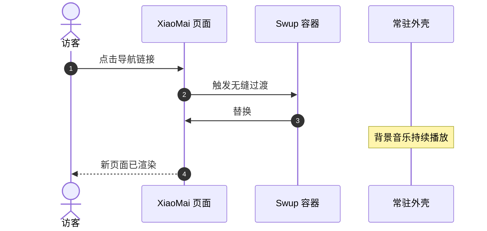

欢迎使用 **XiaoMai**（小麦）——一款富有表现力、受动漫风格启发的博客主题，围绕 **Astro 7**、**Svelte 5** 与 **Material 3 Expressive（M3E）** 设计系统打造。

本指南将带你了解文章创建、frontmatter 规范、目录结构，以及全套内置的 Markdown 与 MDX 扩展。

:::tip
XiaoMai 优先在服务器端渲染内容（SSR-first）。在站内导航时，Swup 会无缝替换主容器，同时保留外层应用外壳与持续的背景音乐播放。
:::

---

## 1. 创建新文章

你可以使用内置 CLI 命令快速生成带有标准 frontmatter 的新文章：

```bash
# 创建单文件文章
pnpm new-post my-first-post

# 或在子目录中创建文章
pnpm new-post guides/getting-started
```

新创建的文件会放置在 `src/content/posts/` 目录下。

---

## 2. Frontmatter 规范

每篇 Markdown（`.md`）或 MDX（`.mdx`）文章都以一段 YAML frontmatter 开头，用于定义其元数据。

### 示例

```yaml
---
title: "Exploring Material 3 Expressive Design"
published: 2026-08-26
updated: 2026-08-27
publishedAt: 2026-08-26T10:00:00+08:00
updatedAt: 2026-08-27T09:30:00+08:00
pinned: true
description: "A deep dive into dynamic HCT color science and fluid transitions in XiaoMai."
image: "./cover.webp"
tags: [M3E, Design, Frontend]
category: Guides
draft: false
comment: true
---
```

### 支持的 Frontmatter 字段

| 字段 | 类型 | 必填 | 说明 |
| :--- | :--- | :---: | :--- |
| `title` | `string` | **是** | 文章的主标题。 |
| `published` | `Date` | **是** | 发布日期，格式为 `YYYY-MM-DD`。 |
| `publishedAt` | `Date` | 否 | 精确发布时刻，用于排序同一天发布的文章。它必须落在 `published` 所配置的站点时区内。 |
| `updated` | `Date` | 否 | 最后更新日期。提供后会显示更新提示徽标。 |
| `updatedAt` | `Date` | 否 | 供订阅源与机器可读元数据使用的精确更新时刻。必须与 `updated` 配对。 |
| `pinned` | `boolean` | 否 | 将文章置顶到文章列表顶部（默认：`false`）。 |
| `description` | `string` | 否 | 文章摘要，显示在文章卡片、搜索结果与 OpenGraph 元数据中。 |
| `image` | `string` | 否 | 封面图路径。支持相对路径（`./cover.webp`）、公共路径（`/images/cover.jpg`）或远程 URL。 |
| `tags` | `string[]` | 否 | 用于分类筛选与标签云的标签名数组。 |
| `category` | `string` | 否 | 用于分类索引的主分类名称。 |
| `draft` | `boolean` | 否 | 标记为draft。draft文章在生产构建（`pnpm build`）期间会被隐藏。 |
| `comment` | `boolean` | 否 | 为该篇特定文章开关评论区（默认：`true`）。 |
| `lang` | `string` | 否 | 语言代码（例如 `en`、`zh_CN`、`ja`），当与站点默认值不同时使用。 |

---

## 3. 文章加密

XiaoMai 提供客户端文章加密。对于私人日记或受限文章，可在 frontmatter 中指定密码：

```yaml
---
title: "Private Research Notes"
published: 2026-08-26
encrypted: true
password: "your-secret-passphrase"
passwordHint: "Favorite anime character"
hideHomeContent: true
---
```

- `encrypted`：设为 `true` 以启用加密；
- `password`：解锁文章所需的口令字符串或数字；
- `passwordHint`：可选提示，显示在密码输入表单上方；
- `hideHomeContent`：在首页隐藏字数统计与内容预览，防止数据泄露。

---

## 4. 组织文章文件

XiaoMai 同时支持基于文件夹的就近存放与单文件布局：

### 文件夹结构（本地资源推荐）

将文章与其媒体资源就近存放，可让资源管理变得简单：

```text
src/content/posts/
├── my-great-post/
│   ├── index.md           <-- 文章内容
│   ├── cover.webp         <-- 封面图（image: "./cover.webp"）
│   └── diagram.png        <-- Markdown 中引用的内联插图
```

### 单文件结构（轻量随笔）

```text
src/content/posts/
├── hello-world.md
└── quick-thoughts.md
```

---

## 5. 丰富的 Markdown 与 MDX 扩展

XiaoMai 开箱即用地内置了现代化的 Markdown 扩展：

### 5.1 admonitions（Admonitions）

使用容器指令来呈现备注、提示、警告与警示：

```markdown
:::tip
使用admonitions容器来突出关键要点或最佳实践。
:::

:::warning
使用警告容器来提示潜在的陷阱或破坏性变更。
:::
:::note
使用备注容器来记录补充性的背景信息或补充说明。
:::
:::info
使用信息容器来提供中性的上下文说明，帮助理解周围内容。
:::
:::important
使用重要容器来强调必须留意的关键事项或约束条件。
:::
:::caution
使用警示容器来标注高风险、不可逆或需要格外小心的操作。
:::
:::details
使用详情容器来收纳可折叠的可选内容，默认收起。
:::
```

:::tip
使用admonitions容器来突出关键要点或最佳实践。
:::

:::warning
使用警告容器来提示潜在的陷阱或破坏性变更。
:::

:::note
使用备注容器来记录补充性的背景信息或补充说明。
:::
:::info
使用信息容器来提供中性的上下文说明，帮助理解周围内容。
:::
:::important
使用重要容器来强调必须留意的关键事项或约束条件。
:::
:::caution
使用警示容器来标注高风险、不可逆或需要格外小心的操作。
:::
:::details
使用详情容器来收纳可折叠的可选内容，默认收起。
:::

### 5.2 GitHub 仓库卡片

使用指令语法嵌入实时、样式精美的 GitHub 仓库卡片：

```markdown
::github{repo="GrowWheat/XiaoMai"}
```

::github{repo="GrowWheat/XiaoMai"}

### 5.3 Expressive Code 代码块

增强型代码块具备语法高亮、文件名徽标、行号以及选择性行高亮等特性：

```typescript title="src/utils/theme.ts" {2,4-5}
// Dynamic HCT color token derivation
import { argbFromHex, themeFromSourceColor } from "@material/material-color-utilities";

const theme = themeFromSourceColor(argbFromHex("#f472b6"));
console.log("Primary color token:", theme.schemes.light.primary);
```

### 5.4 数学排版（KaTeX）

直接在 Markdown 中渲染优雅的 LaTeX 数学公式：

- **行内公式**： $E = mc^2$ 或欧拉公式 $e^{i\pi} + 1 = 0$。
- **块级公式**：

$$
\int_{-\infty}^{\infty} e^{-x^2} \, dx = \sqrt{\pi}
$$

### 5.5 Mermaid 图表

使用纯文本创建流程图、时序图与架构图：



### 5.6 图片画廊与 Fancybox 灯箱

图片会自动与 Fancybox 集成，支持无损缩放、平移手势与全屏预览：

```markdown

```


------

## 6. 后续步骤与自定义

- **站点配置**：了解 `src/config/siteConfig.ts` 与 [`src/config/README.md`](/about/) 中的全局设置。
- **设计令牌**：在 `DESIGN.md` 与 `docs/m3e-standard.md` 中探索令牌与调色板。
- **反馈与社区**：在 [GitHub Issues](https://github.com/GrowWheat/XiaoMai/issues) 上分享你的想法与问题。
