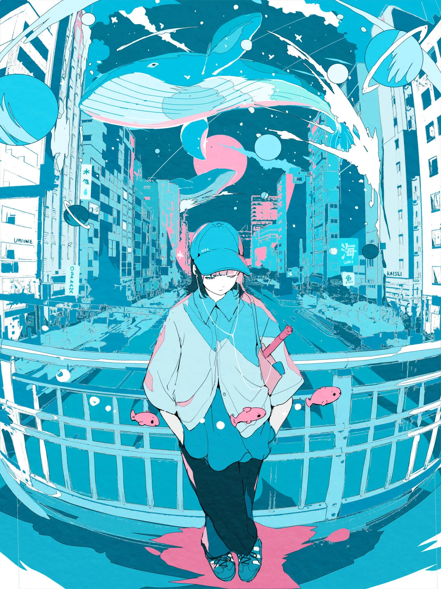
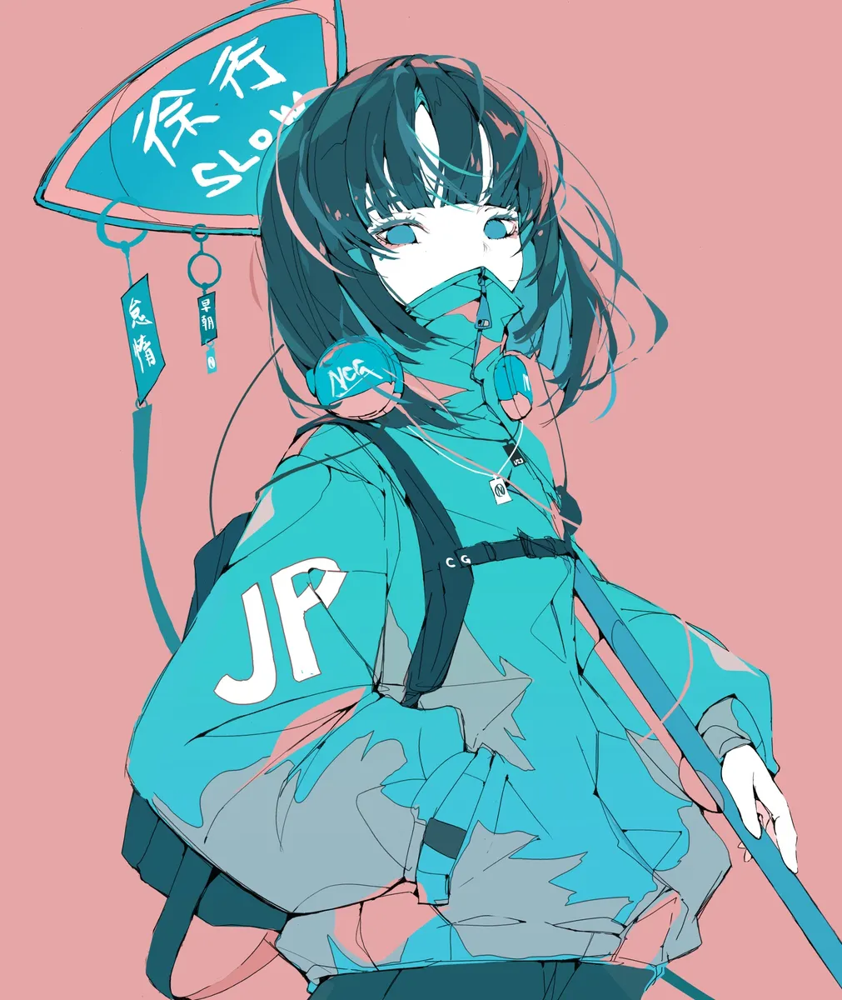

`:::grid` 是博客的图片画廊容器指令。它把普通 Markdown 图片排列成统一宽高比、响应式的网格，并自动启用灯箱查看。可用于文章配图、截图、作品集或小型相册。

同一画廊中的图片采用相同的卡片比例。默认情况下，居中对齐裁剪会填满每张卡片，并保持每一行整齐；点击图片会在灯箱中打开完整的原图。每个画廊拥有独立的灯箱分组，不会与文章中的其他图片混在一起。

> 本文既是功能文档，也是视觉测试页。请在桌面、平板和手机宽度下查看示例，然后点击任意图片以验证灯箱分组是否正确。

## 最简语法

直接在 `:::grid` 与结束标记 `:::` 之间书写 Markdown 图片：

````markdown
:::grid


:::
````

每张图片必须独占一个段落，图片之间需保留空行。画廊中只放图片；段落、列表和代码块请写在容器之外。

以下是最简语法的效果。不带参数时，网格默认使用三列、`16/10` 比例和 `cover` 填充模式。

:::grid


:::

## 参数一览

将所有参数以花括号写在起始指令之后：`:::grid{parameter="value"}`。

| 参数 | 允许值 | 默认值 | 用途 |
| --- | --- | --- | --- |
| `columns` | `1` 到 `6` 之间的整数 | `3` | 桌面端每行显示的列数。非法值回退到 `3`。 |
| `aspect` | 正比例，例如 `16/9`、`3/4` 或 `1/1` | `16/10` | 显示的卡片比例，而非原始图片比例。 |
| `fit` | `cover`、`contain` | `cover` | 图片适配模式。`cover` 裁剪填充；`contain` 保留完整图片，可能留下空白。 |

完整示例：

````markdown
:::grid{columns="3" aspect="16/9" fit="cover"}


:::
````

以下结果使用了上面的三列横向语法。请对比卡片比例、列数，以及标题优先于 alt 文本作为图注的方式：

:::grid{columns="3" aspect="16/9" fit="cover"}


:::

## 图注与 Alt 文本

图片的 alt 文本既作为无障碍替代文本，也作为默认图注。当图片带有可选的标题（title）时，将以该标题作为图注：

```markdown

```

在同一行中，图注会统一对齐到每张卡片的底部。折行的图注不会使其他卡片浮动到不同高度。诸如 `3:4` 和 `16:9` 这样的比例文字可直接写在正文、标题和 alt 文本中，无需转义。

以下示例演示了默认 alt 文本图注、显式标题图注，以及较长图注的底部对齐：

:::grid{columns="3" aspect="1/1"}


:::

## 布局与裁剪

桌面布局采用 `columns` 指定的列数。低于 `768px` 时，网格最多两列；低于 `480px` 时，切换为一列。卡片外层固定 `aspect` 比例并裁剪圆角，图片则填满卡片，不受主题默认图片边距影响。

- 选择 `cover`：推荐的默认模式。图片从中心裁剪以填满卡片，使画廊看起来整齐一致。
- 选择 `contain`：显示完整原图，不做裁剪。当其比例与卡片不同时，主题背景会保持可见；适用于不能裁剪的图片。
- 若要保留完整图片且不出现空白，请将 `aspect` 设置为接近原图比例，或将图片单独放入一个网格。

以下示例将相同的纵向图片分别放入 `16/9` 卡片，使用 `cover` 与 `contain`。前者裁剪图片；后者保留完整图片并留出背景空间。

````markdown
:::grid{columns="3" aspect="16/9" fit="cover"}


:::

:::grid{columns="3" aspect="16/9" fit="contain"}


:::
````

:::grid{columns="3" aspect="16/9" fit="cover"}



:::

:::grid{columns="3" aspect="16/9" fit="contain"}


:::

## 默认配置

不带属性时，默认是三列、`16/10` 比例和 `cover` 裁剪。这三张纵向图片用于验证默认裁剪与图注。

````markdown
:::grid


:::
````

:::grid


:::

## 三列纵向图片：3:4

使用 `aspect="3/4"` 时，三张纵向图片会填满比例一致的竖卡片。若原图比例不同，`cover` 会从中心裁掉边缘。

````markdown
:::grid{columns="3" aspect="3/4"}



:::
````

:::grid{columns="3" aspect="3/4"}


:::

## 三列横向图片：16:9

这组示例演示了三列布局中常见的视频封面比例。当横向图片接近卡片比例时，裁剪量最小。

````markdown
:::grid{columns="3" aspect="16/9"}


:::
````

:::grid{columns="3" aspect="16/9"}


:::

## 两列方形图片：1:1

需要较大预览卡片时，两列效果很好。第三张图片会移到下一行。最后一行保持网格轨道宽度，而不会拉伸图片填满整行。

````markdown
:::grid{columns="2" aspect="1/1"}


:::
````

:::grid{columns="2" aspect="1/1"}


:::

## 四列与 `contain`

`fit="contain"` 不会对原图做裁剪。当图片比例与卡片比例不同，主题背景会保持可见。这是有意为之，而非布局问题。它同时验证了四列网格与独立灯箱分组不会互相干扰。

````markdown
:::grid{columns="4" aspect="16/9" fit="contain"}


:::
````

:::grid{columns="4" aspect="16/9" fit="contain"}


:::

## 单列细节图片

当图片需要较大阅读尺寸时，单列正合适。它在桌面、平板和手机上都保持单列，灯箱中仍可查看原图。

````markdown
:::grid{columns="1" aspect="16/9"}

:::
````

:::grid{columns="1" aspect="16/9"}

:::

## 稀疏五列行

五列用于验证更高的支持列数。由于只有三张图片，最后一行保持左对齐，而不会拉伸图片。

````markdown
:::grid{columns="5" aspect="1/1"}


:::
````

:::grid{columns="5" aspect="1/1"}


:::

## 六列中的混合图片

六列是当前的最大值。混合横向与纵向图片，用于验证 `cover` 裁剪、窄卡片上的图注，以及密集的桌面布局。就文章正文可读性而言，通常两到四列更合适。

````markdown
:::grid{columns="6" aspect="1/1"}


:::
````

:::grid{columns="6" aspect="1/1"}


:::

## 四列方形图片：1:1

四张比例相同的方形图片是典型的四列布局。桌面端在一行内显示全部四张；平板折叠为两列，手机折叠为一列。

````markdown
:::grid{columns="4" aspect="1/1"}


:::
````

:::grid{columns="4" aspect="1/1"}


:::

## 六列横向图片：16:9

六列横向布局适合缩略图预览、作品集和截图索引。即使原图比例略有差异，`cover` 也能一致地填满每张 `16/9` 卡片。

````markdown
:::grid{columns="6" aspect="16/9"}


:::
````

:::grid{columns="6" aspect="16/9"}


:::

## 三列纵向图片：3:4

这一组六张纵向图片演示了人物、海报或手机截图的常见布局。图片组成两行三列，图注对齐到底部。

````markdown
:::grid{columns="3" aspect="3/4"}


:::
````

:::grid{columns="3" aspect="3/4"}


:::

## 边缘敏感内容：`cover` 与灯箱

这些图片在边缘附近包含重要文字或细节。`cover` 能保持网格整齐，但可能裁掉这些边缘；点击图片可在灯箱中查看未裁剪的原图。对于边缘敏感图片，请使用清晰的图注，或改用下方的 `contain`。

````markdown
:::grid{columns="3" aspect="16/9" fit="cover"}


:::
````

:::grid{columns="3" aspect="16/9" fit="cover"}


:::

## 极端比例与 `contain`

对于横幅、长截图及其他极端图片比例，`contain` 会显示完整原图。与 `cover` 不同，它可能留下主题背景空间，但绝不会裁剪内容。

````markdown
:::grid{columns="3" aspect="16/9" fit="contain"}


:::
````

:::grid{columns="3" aspect="16/9" fit="contain"}


:::

## 透明图片

透明图片会露出卡片的主题背景。这个单列 `contain` 示例便于检查透明区域、原图边缘与灯箱行为。

````markdown
:::grid{columns="1" aspect="16/9" fit="contain"}

:::
````

:::grid{columns="1" aspect="16/9" fit="contain"}

:::

## 灯箱导航

点击网格中任意图片即可打开 Fancybox 灯箱。在其中可以缩放、旋转、进入全屏、查看缩略图，并使用方向键导航。导航仅限于当前的 `:::grid` 容器：例如，点击"16:9 测试图片一"只会打开该节中另外两张横向图片。

同一文章中的普通 Markdown 图片仍会被单独处理；它们不会被加入任何网格画廊。

## 检查清单

1. 每个网格中的图片尺寸一致，图注显示在卡片下方。
2. 图片在悬停时轻微缩放；点击后可缩放、旋转，并用键盘导航。
3. 点击"16:9 测试图片一"时，灯箱仅能浏览该节中另外两张横向图片。
4. 低于 768px 时，网格最多两列；低于 480px 时，为一列。
5. "四列与 `contain`"中的纵向图片完整可见，留有空白，未被裁剪。
6. 五列与六列网格在宽屏上保持指定列数，随后按响应式规则折叠为两列或一列。
