Mermaid 能将 Markdown 中的文字描述转换为图表。下面的示例借助 XiaoMai 的内容工作流，演示技术文章与项目笔记中常用的图表类型。

## 流程图

流程图用于描述一个过程，包括判断分支以及回到较早步骤的路径。

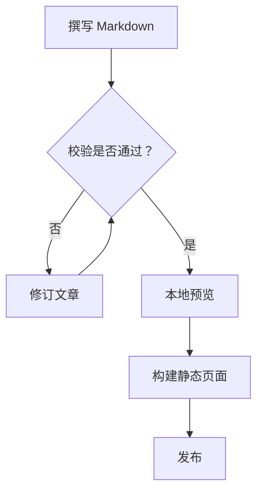

## 时序图

时序图按时间顺序呈现参与者之间的协作。本例跟踪一次从请求到 Mermaid 渲染的 Swup 导航。

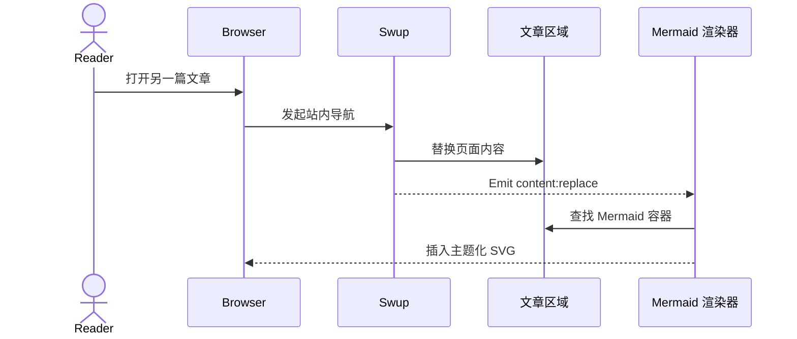

## 实体关系图

实体关系图用于建模结构化数据，以及作者、文章、标签与评论之间的关联。

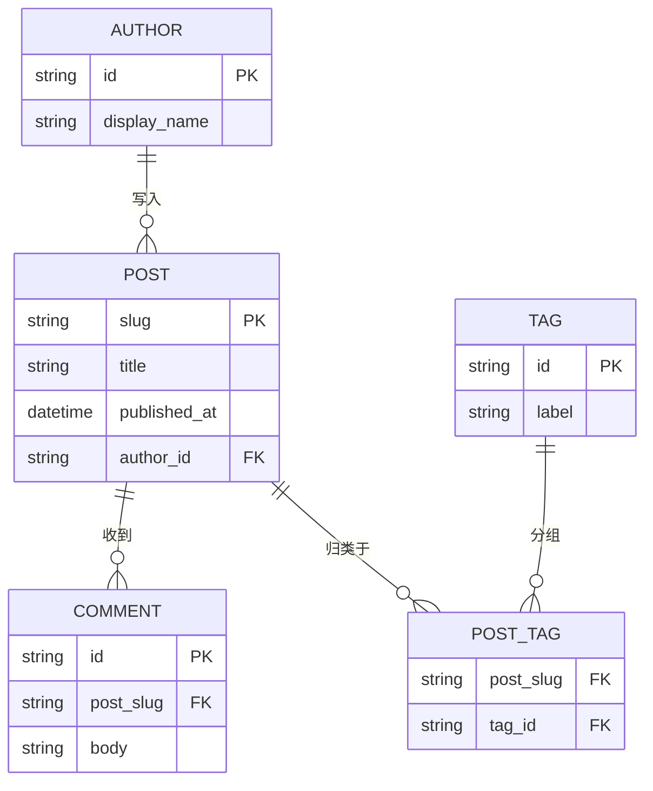

## 类图

类图用于表达软件设计中的职责、公共方法以及依赖方向。

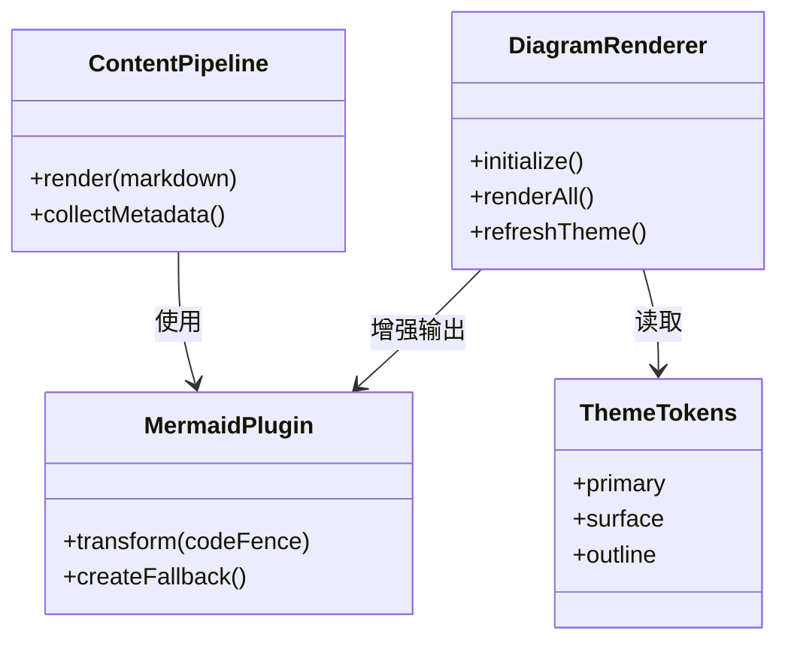

## 状态图

状态图展示对象的生命周期，以及推动其在各状态间跃迁的事件。

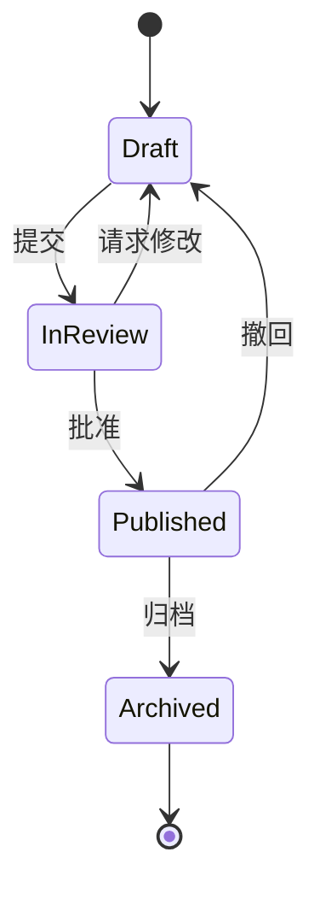

## XY 图表

XY 图表结合柱状与折线，在同一坐标轴上比较数值与趋势。

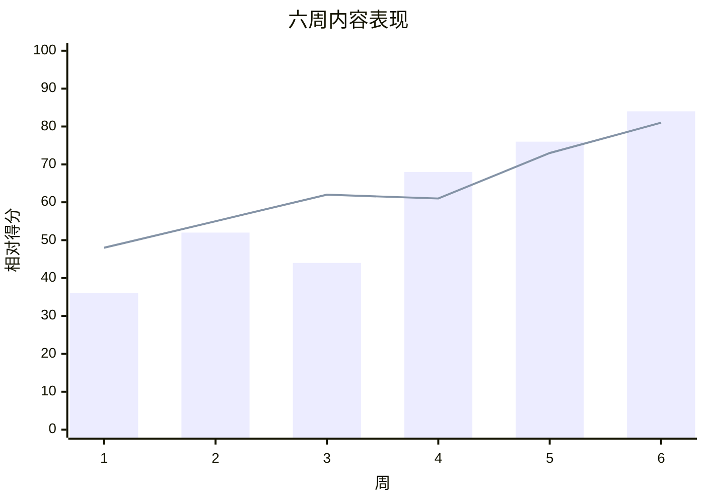

## 饼图

饼图以紧凑方式比较各分类在整体中所占的比重。

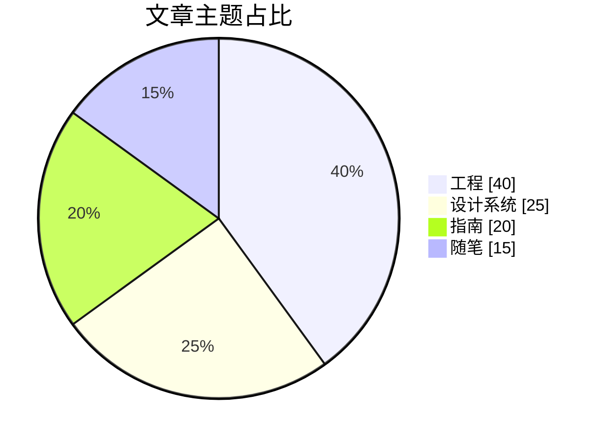

## 甘特图

甘特图沿日历时间线排布任务、依赖关系与里程碑。

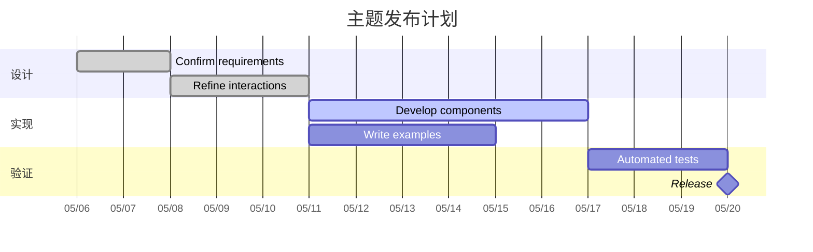

## 思维导图

思维导图将一个中心主题展开为相关领域与支撑概念。

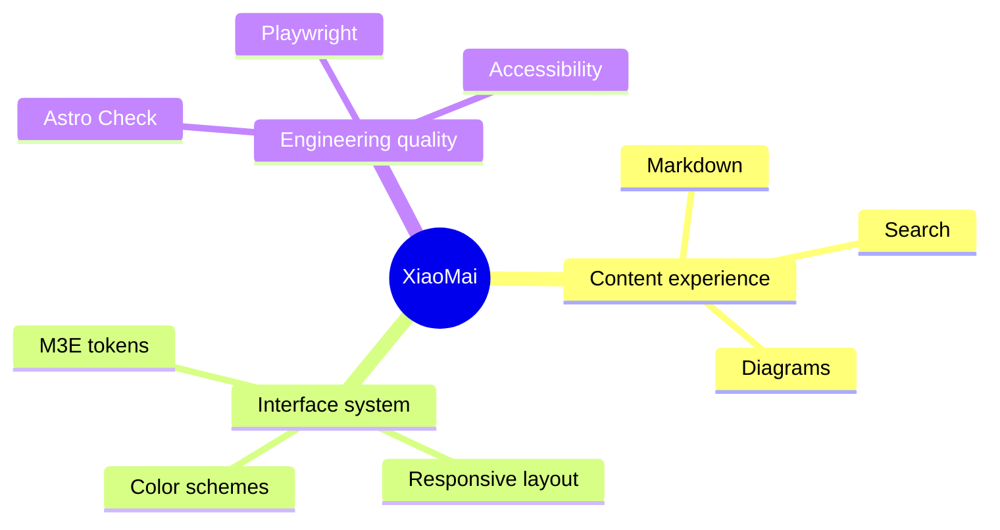

## 时间线

时间线用于概括重要事件或阶段，无需给出精确的日历时长。

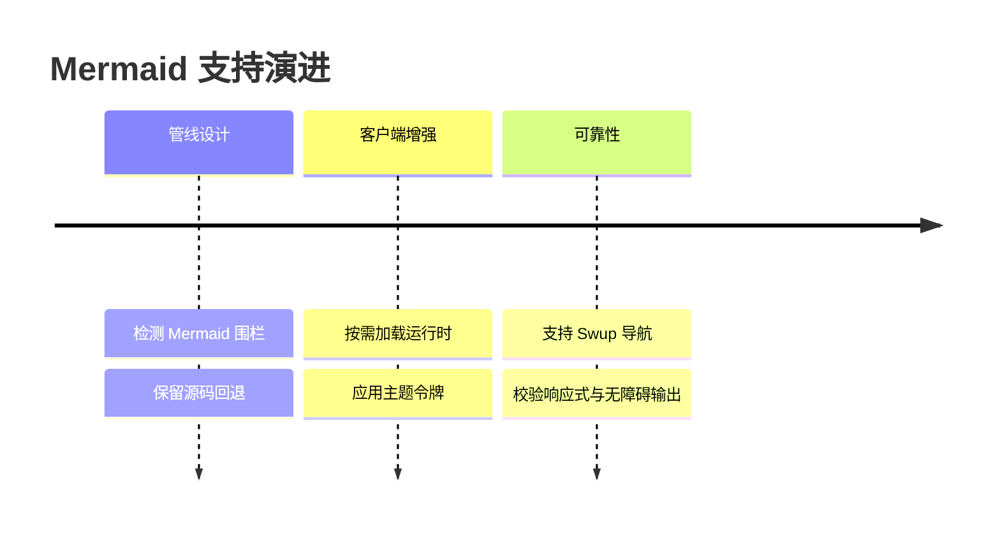

## 用户旅程图

用户旅程图结合任务各阶段中的操作、参与者与体验评分。

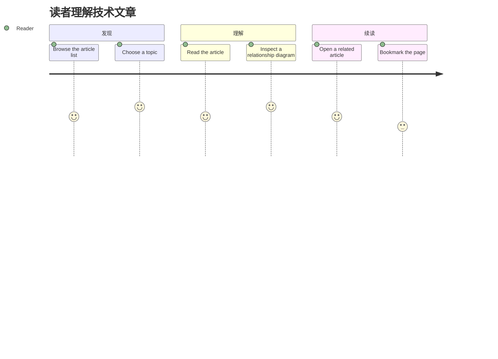

## Git 图

Git 图展示功能分支在合并回主线之前的工作推进过程。

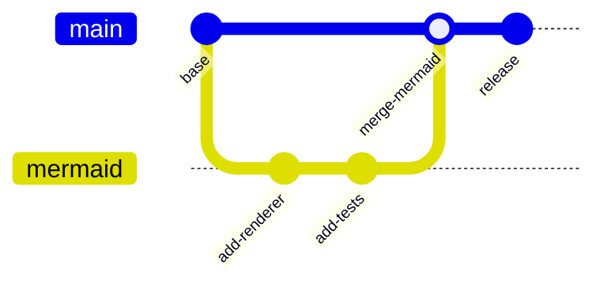

## 看板

看板按工作流状态对任务分组，便于快速浏览当前进度。

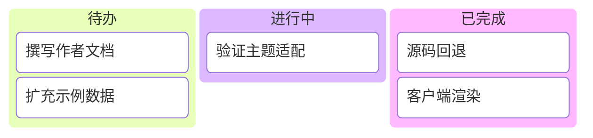

## 桑基图

桑基图用连线宽度表示流量或其他数量在节点之间的流动。

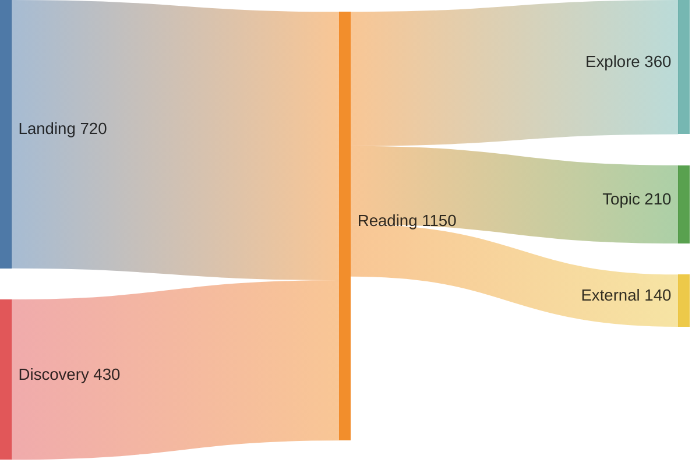

每个示例都使用标准的 `mermaid` 代码围栏。服务端会保留可读的源码标记，浏览器则将其增强为遵循当前主题的 SVG。当主题切换或 Swup 导航到本文时，图表会重新渲染。
