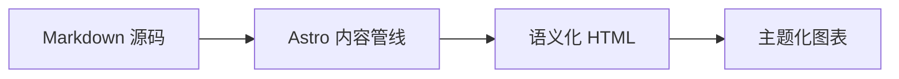

## GitHub 仓库卡片

你可以添加动态卡片来链接到 GitHub 仓库，页面加载时，仓库信息会从 GitHub API 拉取。

::github{repo="Fabrizz/MMM-OnSpotify"}

使用代码 `::github{repo="<owner>/<repo>"}` 创建 GitHub 仓库卡片。

```markdown
::github{repo="saicaca/fuwari"}
```

## Mermaid 图表

围栏的 `mermaid` 代码块会渲染为图表，并跟随当前的配色方案。



## admonitions（Admonitions）

支持以下几种admonitions：`note` `tip` `important` `warning` `caution`

:::note
提示用户应当留意的信息，即使只是略读也应注意到。
:::

:::tip
帮助用户更顺利完成的选填信息。
:::

:::important
用户成功所必需的关键信息。
:::

:::warning
由于潜在风险，需要用户立即关注的关键内容。
:::

:::caution
某项操作可能带来的负面后果。
:::

### 基本语法

```markdown
:::note
提示用户应当留意的信息，即使只是略读也应注意到。
:::

:::tip
帮助用户更顺利完成的选填信息。
:::
```

### 自定义标题

admonitions的标题可以自定义。

:::note[MY CUSTOM TITLE]
这是一个带有自定义标题的 note。
:::

```markdown
:::note[MY CUSTOM TITLE]
这是一个带有自定义标题的 note。
:::
```

### GitHub 语法

> [!TIP]
> [GitHub 语法](https://github.com/orgs/community/discussions/16925) 同样受支持。

```
> [!NOTE]
> GitHub 语法同样受支持。

> [!TIP]
> GitHub 语法同样受支持。
```

### 剧透

你可以给文字添加剧透。文字同样支持 **Markdown** 语法。

The content :spoiler[is hidden **ayyy**]!

```markdown
The content :spoiler[is hidden **ayyy**]!

```

## 图片宽度与图注

独立的图片在其 alt 文本中可接受一个可选的 `w-N%` 宽度标记，以及一个渲染为图片下方居中图注的 Markdown 标题：


```markdown

```

有效宽度范围从 `w-1%` 到 `w-100%`；无效的标记会保留在 alt 文本中。宽度与图注相互独立——仅使用标题也会生成图注：


