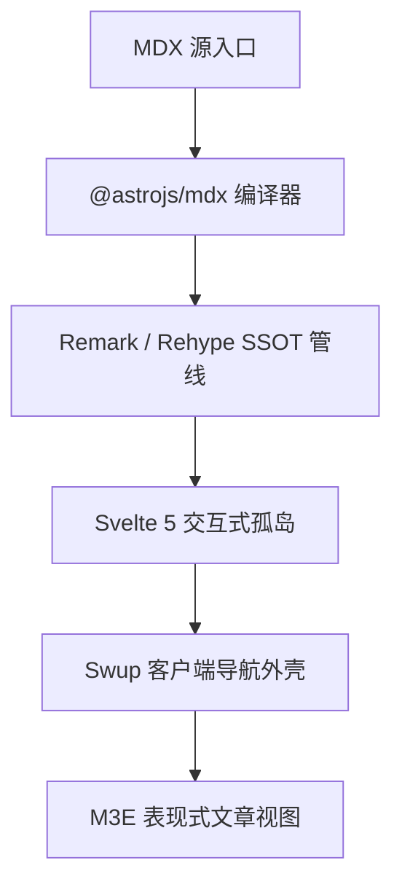

import Button from "@components/atoms/action/Button.svelte";
import Chips from "@components/atoms/action/Chips.svelte";
import Card from "@components/atoms/display/Card.svelte";
import AccentBar from "@components/atoms/display/AccentBar.svelte";
import Badge from "@components/atoms/display/Badge.svelte";
import Divider from "@components/atoms/display/Divider.svelte";
import Skeleton from "@components/atoms/display/Skeleton.svelte";
import LoadingIndicator from "@components/atoms/feedback/LoadingIndicator.svelte";
import ProgressIndicator from "@components/atoms/feedback/ProgressIndicator.svelte";
import TextField from "@components/atoms/input/TextField.svelte";
import Switch from "@components/atoms/selection/Switch.svelte";
import Checkbox from "@components/atoms/selection/Checkbox.svelte";
import SegmentedButton from "@components/atoms/selection/SegmentedButton.svelte";
import Slider from "@components/atoms/selection/Slider.svelte";

export const authorInfo = {
  framework: "Astro 7",
  ui: "Svelte 5",
  tokens: "M3E Design Tokens",
  architecture: "孤岛架构"
};

export const showcaseItems = [
  { name: "原子组件嵌入", desc: "在文章内容中直接导入并渲染 60+ 个 M3E 原子与分子组件" },
  { name: "Svelte 5 孤岛", desc: "通过 client:visible 的选择性注水，确保零多余的 JavaScript 开销" },
  { name: "JSX 表达式", desc: "原生 JavaScript 变量、数据映射与条件渲染" },
  { name: "扩展管线", desc: "面向 Mermaid、KaTeX、Admonitions 与 Expressive Code 的统一 SSOT 编译" }
];

export const filterChipOptions = [
  { value: "all", label: "全部组件" },
  { value: "display", label: "展示原子" },
  { value: "feedback", label: "反馈" },
  { value: "action", label: "交互" }
];

export const segmentedOptions = [
  { value: "linear", label: "线性" },
  { value: "circular", label: "圆形" },
  { value: "morph", label: "形变" }
];

:::tip
**MDX（Markdown + JSX）** 弥合了静态写作与应用程序界面之间的鸿沟。在 XiaoMai 中，作者可以在文章正文中无缝混合动态逻辑、响应式的 Svelte 5 组件以及 Material 3 设计令牌。
:::

## 1. Markdown 与 MDX 能力矩阵

| 特性 | 标准 Markdown（`.md`） | XiaoMai MDX（`.mdx`） | 执行模式 |
| :--- | :--- | :--- | :--- |
| **排版与结构** | 完整支持 | 完整支持 | 静态 SSR |
| **代码高亮** | 行号、边框、可折叠 | 行号、边框、可折叠 | 静态 SSR（Expressive Code） |
| **图表与数学** | Mermaid、KaTeX | Mermaid、KaTeX | 客户端增强 |
| **admonitions Admonitions** | Note、Tip、Important、Warning、Caution | Note、Tip、Important、Warning、Caution | 静态 SSR |
| **M3E 展示原子** | 不可用 | 直接集成（`<Card>`、`<Skeleton>`） | 纯 SSR（零客户端 JS） |
| **Svelte 5 响应式孤岛** | 不可用 | 按需注水（`<Button>`、`<Switch>`） | `client:visible` 惰性注水 |
| **反馈与加载原子** | 不可用 | 动画形变（`<LoadingIndicator>`） | `client:visible` 响应式 |
| **动态 JSX 表达式** | 不可用 | 原生求值（`{authorInfo.ui}`） | 编译期 / 客户端 |

---

## 2. 动态表达式与数据映射

MDX 允许在文件顶部使用 `export const` 声明作用域常量，它们可以行内求值或跨模板映射：

- **核心框架**：{authorInfo.framework}
- **UI 引擎**：{authorInfo.ui}
- **设计令牌**：{authorInfo.tokens}
- **架构模式**：{authorInfo.architecture}

数组与集合可以动态渲染为网格布局：

  {showcaseItems.map((item, idx) => (
    

      

        
          {idx + 1}
        
        {item.name}
      

      
{item.desc}

    

  ))}

---

## 3. M3E 展示与布局原语（仅 SSR）

按照 XiaoMai 的组件架构（`docs/atomic-structure.md`），无状态展示组件会输出干净、无障碍的语义化 HTML，且不带来任何客户端运行时开销。

### 3.1 卡片容器（`Card.svelte`）

  <Card variant="filled" class="!p-5">
    
填充卡片

    
默认容器背景，无悬浮阴影。适合分组内容块。

  </Card>

  <Card variant="elevated" class="!p-5">
    
悬浮卡片

    
一级容器高度，附带交互状态分层以提升视觉焦点。

  </Card>

  <Card variant="outlined" class="!p-5">
    
描边卡片

    
清晰的 1px 描边边界，在中性表面上提供干净的分割。

  </Card>

### 3.2 强调条与徽标（`AccentBar` 与 `Badge`）

  <AccentBar size="large" />
  

    系统公告
    
将 AccentBar 与 Badge 组合，构建醒目的视觉提示

  

  <Badge>M3E v0.192</Badge>

### 3.3 骨架占位（`Skeleton.svelte`）

用于预览布局骨架或搭建异步状态原型：

  

    <Skeleton variant="circle" width="2.5rem" height="2.5rem" />
    

      <Skeleton variant="text" width="40%" height="0.875rem" />
      <Skeleton variant="text" width="25%" height="0.75rem" />
    

  

  <Skeleton variant="rect" width="100%" height="3rem" radius="0.5rem" />

---

## 4. 反馈与加载指示器

XiaoMai 提供高保真的 Material 3 Expressive 动效与反馈原子：

### 4.1 形变动加载指示器（`LoadingIndicator.svelte`）

基于 `androidx.graphics.shapes` 多边形形变实现，提供平滑的弹簧插值七形状动画：

  

    

      <LoadingIndicator client:visible />
    

    不确定形状形变
  

  

    

      <LoadingIndicator client:visible contained />
    

    内含圆形变体
  

  

    

      <LoadingIndicator client:visible progress={0.68} />
    

    确定进度（68%）
  

### 4.2 线性与不确定进度（`ProgressIndicator.svelte`）

  

    

      管线编译
      80%
    

    <ProgressIndicator client:visible progress={0.8} />
  

  

    
连续双线动画

    <ProgressIndicator client:visible />
  

---

## 5. 交互式 Svelte 5 孤岛

使用 `client:visible` 声明的组件在进入视口时，会通过 `IntersectionObserver` 惰性注水：

### 5.1 按钮矩阵（`Button.svelte`）

  <Button client:visible variant="filled">填充按钮</Button>
  <Button client:visible variant="elevated">悬浮</Button>
  <Button client:visible variant="tonal">色调按钮</Button>
  <Button client:visible variant="outlined">描边</Button>
  <Button client:visible variant="text">文本按钮</Button>

### 5.2 筛选芯片与分段按钮（`Chips` 与 `SegmentedButton`）

  

    
M3E 筛选芯片

    <Chips client:visible items={filterChipOptions} value="all" />
  

  <Divider />

  

    
分段控件

    <SegmentedButton client:visible options={segmentedOptions} value="linear" />
  

### 5.3 开关、复选框与滑块（`Switch`、`Checkbox`、`Slider`）

  

    带状态图标的开关
    <Switch client:visible checked={true} icons label="推送通知" />
  

  <Divider />

  

    选择复选框
    

      <Checkbox client:visible checked={true} label="已选" />
      <Checkbox client:visible checked={false} label="未选" />
      <Checkbox client:visible checked={null} triState label="不确定" />
    

  

  <Divider />

  

    色相频谱滑块
    <Slider client:visible value={60} label="色相调整" />
  

### 5.4 输入控件（`TextField.svelte`）

  <TextField client:visible variant="filled" label="填充文本框" placeholder="请输入文本……" />
  <TextField client:visible variant="outlined" label="描边文本框" placeholder="请输入文本……" />

---

## 6. Markdown 扩展兼容性

XiaoMai 的 SSOT 统一插件管线保持了与所有 Markdown 扩展的完全兼容：

### 6.1 GitHub 仓库卡片

::github{repo="saicaca/fuwari"}

### 6.2 Mermaid 架构图

### 6.3 数学表达式（LaTeX / KaTeX）

行内公式：质能等价 $E = mc^2$ 与高斯积分 $\int_{-\infty}^{\infty} e^{-x^2} dx = \sqrt{\pi}$。

块级公式：

$$
\mathcal{L}_{M3E} = \sum_{i=1}^{N} \left( \text{Token}_i \cdot \text{ContrastRatio} \right) + \lambda \|\text{MotionElegance}\|
$$

---

## 7. 总结

MDX 的原生集成让技术作者能够构建丰富、交互式的文档，同时保留 XiaoMai 极快的静态性能。所有组件都遵循 Material 3 Expressive 令牌设计体系，确保一致性、无障碍与视觉和谐。
