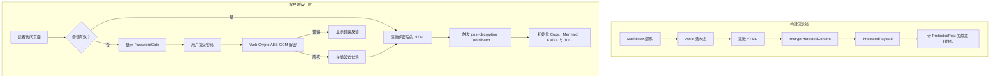

# 受密码保护的文章

恭喜！你已成功解锁这篇加密文章。浏览器使用 **Web Crypto API（AES-256-GCM + PBKDF2）** 在本地解密了这段预编译内容。

---

## 1. 安全架构与核心特性

XiaoMai 的文章加密系统与受保护的相册共享统一的安全基础，为静态发布提供企业级安全性：

1. **静态 HTML 构建中零明文**  
   在 Astro SSG 构建流程中，文章 Markdown 被编译为 HTML，并在输出页面前立即使用 AES-256-GCM 加密。已发布的静态 HTML 中**不包含任何明文**的受保护正文或大纲。

2. **带 AAD 作用域绑定的认证加密**  
   - 密钥派生遵循 OWASP 建议，采用 **310,000 次 PBKDF2 迭代**（SHA-256）与密码学安全的 16 字节随机盐；
   - 每个加密载荷都生成独立的 12 字节随机 IV；
   - **附加认证数据（AAD）** 绑定 `xiaomai-protected-content:1:post:${slug}`，确保密文无法在不同文章或相册之间重放。

3. **会话持久化与密码零磁盘存储**  
   - 解密后的内容缓存在临时浏览器会话存储中，有效期 30 分钟；
   - 明文密码绝不会被写入磁盘或存储；
   - 解密状态在同一会话内的 Swup 客户端导航与页面刷新之间无缝保持。

4. **全站泄露防护**  
   - **搜索索引**：静态页面不含明文，防止搜索引擎与 Pagefind 索引私有内容；
   - **RSS 订阅源**：受保护文章在订阅源中输出本地化占位符，防止 RSS 聚合器抓取敏感文本；
   - **卡片摘要与字数**：当配置 `hideHomeContent: true` 时，索引页与归档卡片上的描述与字数会被掩码；
   - **目录（TOC）**：标题层级在解锁前保持隐藏，并在解密后动态重建并与 M3E 样式同步。

> 💡 **演示说明**：本演示文章的默认解锁密码为 `xiaomai-secret`。

---

## 2. 交互式富内容演示

文章解密会与运行时辅助函数协同，动态挂载语法高亮、代码折叠、交互式 Mermaid 图、LaTeX 公式与图片灯箱。

### 2.1 代码块与语法高亮

下面的代码块用于测试 Expressive Code 的语法高亮、复制操作与行装饰：

```typescript
import { decryptProtectedContent, type ProtectedPayload } from "@/utils/password-protection";

/**
 * Client-side post decryption example
 */
async function unlockArticle(payload: ProtectedPayload, password: string): Promise<string> {
    const scope = payload.scope;
    console.log(`[XiaoMai] Decrypting scope: ${scope}`);
    
    // Execute AES-256-GCM decryption with AAD verification
    const decryptedHtml = await decryptProtectedContent(payload, password, scope);
    console.log("[XiaoMai] Decryption successful, length:", decryptedHtml.length);
    return decryptedHtml;
}
```

```bash
# Verify build and type checking
npx.cmd astro check
pnpm.cmd type-check
pnpm.cmd test
```

### 2.2 Mermaid 架构图

下面的流程图通过 Mermaid 渲染，并在解密后动态绑定：



### 2.3 LaTeX 数学公式

行内公式：欧拉恒等式 $e^{i\pi} + 1 = 0$ 与高斯积分 $\int_{-\infty}^{\infty} e^{-x^2} dx = \sqrt{\pi}$。

使用横向滚动容器展示数学公式：

$$
f(x) = \frac{1}{\sigma \sqrt{2\pi}} \exp\left( -\frac{(x - \mu)^2}{2\sigma^2} \right)
$$

$$
\mathcal{L}_{\text{AES-GCM}} = \text{GHASH}_H(A \parallel C \parallel L) \oplus \text{AES}_K(J_0)
$$

### 2.4 admonitions（Admonitions）

:::note 架构说明
该加密系统遵循原子化设计（Atomic Design）原则与最小化补丁规范，同时不影响 SSR 稳定性。
:::

:::tip 主题集成
解锁后，尝试在浅色与深色模式之间切换，或更改主色调；解密后的组件会动态适配当前设计令牌。
:::

:::important 安全范围
静态客户端加密旨在防止未授权浏览与自动化索引。对于关键商业机密，建议使用服务端鉴权。
:::

:::warning 密码找回
静态加密没有集中式服务器数据库。若忘记密码，加密内容将无法恢复。
:::

### 2.5 GitHub 仓库卡片

::github{repo="withastro/astro"}

---

## 3. 配置参考

| 参数 | 类型 | 必填 | 默认值 | 说明 |
| :--- | :--- | :--- | :--- | :--- |
| `encrypted` | `boolean` | 否 | `false` | 显式标记文章为已加密。若设置了 `password` 则隐式视为 `true`。 |
| `password` | `string` | 是 | 无 | 构建时用于加密、运行时用于解锁的明文密码。 |
| `passwordHint` | `string` | 否 | `""` | 显示在密码输入框下方的可选提示。 |
| `hideHomeContent` | `boolean` | 否 | `true` | 在索引卡片、归档与 RSS 订阅源中隐藏文章描述与字数统计。 |

---

## 4. 总结

本演示验证了 XiaoMai 中完整的加密生命周期：静态输出零明文、强健的密码学校验、跨导航与页面刷新的会话持久化，以及动态的运行时再水合。
